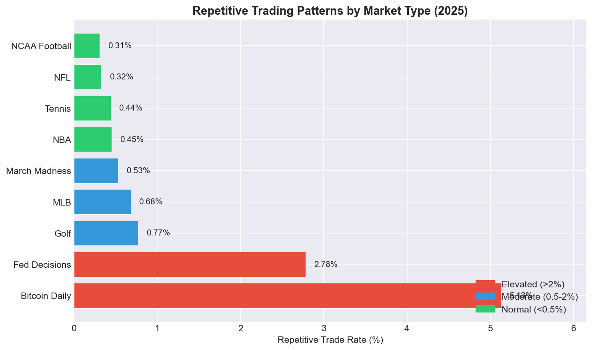
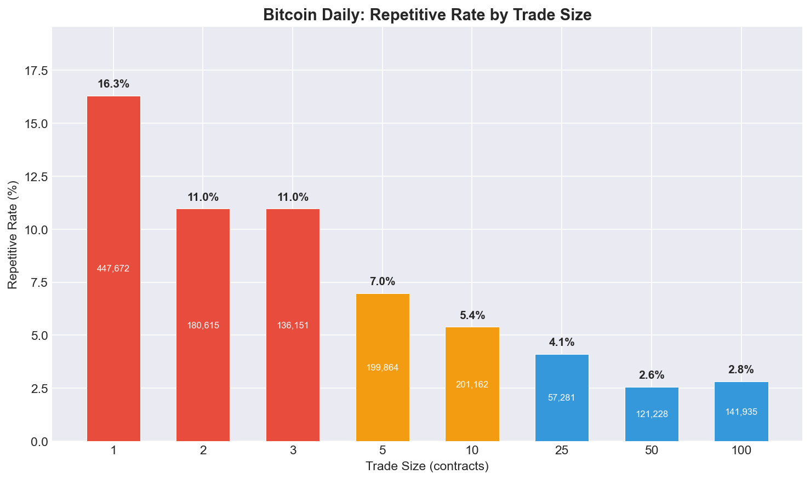
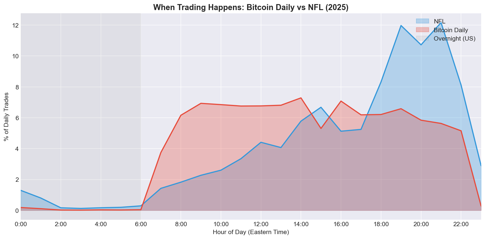
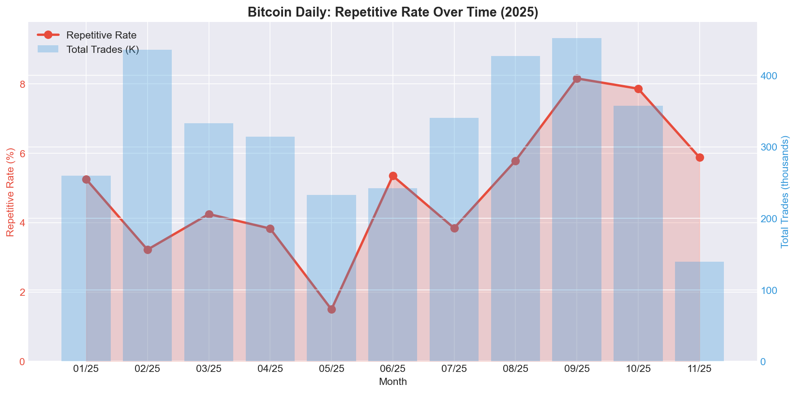

# Kalshi Trading Patterns: A Statistical Analysis

This analysis examines 47.6 million trades on Kalshi to understand trading behavior across different market types. The platform has grown from negligible volume in 2021-2023 to handling nearly 9 billion contracts in 2025 alone—making current patterns far more significant than historical anomalies.

---

## Detecting Repetitive Trading Patterns

Without access to counterparty data (who traded with whom), direct identification of wash trading is impossible. Instead, this analysis looks for **behavioral signatures**—patterns in trade execution that are statistically unlikely under normal trading but common in automated volume generation.

### The Core Metric

A trade is flagged as **repetitive** when:
1. Its size equals the previous trade's size on that contract
2. Its size equals the following trade's size on that contract  
3. The gap between trades is 1-60 seconds

In other words: three consecutive same-size trades in rapid succession.

### Why This Matters

**Human traders vary their sizes.** A person deciding how much to bet considers their conviction, bankroll, and the specific opportunity. Two traders arriving at the same contract will almost never choose identical sizes. Three in a row, within a minute, is unlikely.

**Algorithms repeat sizes.** A bot programmed to generate volume or provide liquidity typically uses fixed parameters. It doesn't "decide" each trade—it executes the same instruction repeatedly. This creates detectable repetition.

**The baseline proves the metric works.** NFL betting—Kalshi's largest and most liquid market—shows a 0.24% repetitive rate. Millions of humans betting on football produce almost no three-in-a-row same-size patterns. When other markets show 5%, 10%, or 20% rates, something different is happening.

### What This Metric Misses

This is a conservative filter. It will miss:
- Sophisticated wash trading that varies sizes
- Algorithmic activity with randomized parameters
- Any manipulation that doesn't produce repetitive patterns

What it catches is the low-hanging fruit: unsophisticated or careless automated trading that doesn't bother to vary execution.

---

## The Big Picture: Where Volume Lives

| Market Type | 2025 Volume | Share | Repetitive Rate |
|-------------|-------------|-------|-----------------|
| NFL Games | 1.19B | 13.4% | 0.24% |
| NCAA Football | 982M | 11.0% | 0.27% |
| NBA Games | 812M | 9.1% | 0.31% |
| MLB Games | 676M | 7.6% | 0.68% |
| March Madness | 413M | 4.6% | 0.53% |
| **Bitcoin Daily** | **328M** | **3.7%** | **5.14%** |
| Tennis (ATP) | 282M | 3.2% | 0.44% |
| **Fed Decisions** | **237M** | **2.7%** | **2.78%** |
| Golf (PGA) | 212M | 2.4% | 0.51% |



Sports betting dominates Kalshi with 50%+ of volume and shows uniformly low repetitive rates (0.2-0.7%). Two categories stand out: **Bitcoin Daily** at 5.14% and **Fed Decisions** at 2.78%—10-20x higher than comparable sports markets.

---

## Bitcoin Daily: The Outlier

**What it is:** KXBTCD lets traders bet whether Bitcoin's price will close above or below specific thresholds each day. Dozens of strike prices, daily resolution, 24/7 trading.

**The numbers:**
- 3.5 million trades in 2025
- 328 million contracts
- 3.7% of platform volume
- **5.14% repetitive rate** (vs 0.24% for NFL)

### The Small-Trade Phenomenon

The repetitive trading in Bitcoin Daily is concentrated in tiny trades:



| Trade Size | Total Trades | Repetitive | Rate |
|------------|--------------|------------|------|
| 1 contract | 447,672 | 72,936 | **16.3%** |
| 2 contracts | 180,615 | 19,812 | 11.0% |
| 3 contracts | 136,151 | 14,937 | 11.0% |
| 5 contracts | 199,864 | 13,903 | 7.0% |
| 10 contracts | 201,162 | 10,848 | 5.4% |
| 100 contracts | 141,935 | 3,954 | 2.8% |

**16.3% of all 1-contract trades** are repetitive. Size-1 trading is economically inefficient (fees eat into small trades), yet it's where the repetitive patterns concentrate.

### When It Happens



NFL betting peaks during primetime (7-10 PM Eastern) when games are broadcast. Bitcoin Daily trading is more evenly distributed but notably active during overnight hours when few US retail traders are awake.

| Gap to Previous Trade | Occurrences |
|-----------------------|-------------|
| Same second | 78,845 |
| 1 second | 32,394 |
| 2 seconds | 20,508 |
| 3+ seconds | gradual decline |

78,845 size-1 trades occurred within the same second as another size-1 trade. This is automated execution.

### Trade Bursts

In 2025, there were 236 instances where 20+ trades hit a single Bitcoin contract within one second. The most extreme: **206 trades in a single second** on November 28, 2025 at 4:10 AM Eastern (contract KXBTCD-25NOV2817-T90499.99).

**The timing is notable:** November 28, 2025 was Black Friday—the morning after Thanksgiving. At 4:10 AM, virtually no US retail traders are awake. Order books are thin. Asian markets are in afternoon trading. This is precisely when algorithmic systems operate with minimal human oversight and maximum impact on thin liquidity.

For comparison, March Madness (similar volume) had 202 such bursts—but those correlate with game-time events (buzzer-beaters, upsets, last-second shots). Bitcoin has no equivalent trigger at 4 AM on a holiday.

### Composition of Repetitive Trades

| Market | Repetitive Trades | At Size 1 | At Size 1-5 |
|--------|-------------------|-----------|-------------|
| KXBTCD | 181,171 | 40.2% | 70.8% |
| KXMARMAD | 7,919 | 28.8% | 42.4% |

Bitcoin Daily has 23x more repetitive trades than March Madness, and they're far more concentrated at minimal sizes.

### The Trend Over Time



The repetitive rate fluctuates between 1.5% and 8% throughout 2025, with peaks in September and October. The pattern isn't worsening or improving—it's consistently elevated compared to sports markets, suggesting persistent algorithmic activity rather than a one-time event.

### What This Might Mean

The patterns are consistent with:
- **Arbitrage bots** tracking Bitcoin prices on Binance/Coinbase and rapidly adjusting positions on Kalshi
- **Market making algorithms** providing liquidity through rapid small trades
- **Volume generation** through repetitive minimal-size trades

The small-trade concentration is the most unusual signal. Legitimate traders typically trade in larger sizes; fees make 1-contract trades economically marginal. The 16.3% repetitive rate at size 1 suggests activity optimizing for something other than profit per trade.

---

## Fed Decisions: Event-Driven Spikes

**What it is:** KXFEDDECISION lets traders bet on Federal Reserve interest rate decisions—whether rates will be cut, held, or raised at each FOMC meeting.

**The numbers:**
- 318,200 trades in 2025
- 237 million contracts
- 2.7% of platform volume
- **2.78% repetitive rate**

### Monthly Pattern

| Month | Trades | Volume |
|-------|--------|--------|
| Jan 2025 | 2,118 | 1.8M |
| Mar 2025 | 3,777 | 2.3M |
| **Apr 2025** | **66,123** | **25.6M** |
| **May 2025** | **48,356** | **32.1M** |
| Jun 2025 | 25,313 | 22.2M |
| **Jul 2025** | **45,698** | **39.0M** |
| **Sep 2025** | **70,992** | **71.4M** |

Trading spikes around FOMC meetings (typically every 6-8 weeks). September 2025 saw 71 million contracts traded—nearly half the category's annual volume in one month.

### Interpretation

The elevated repetitive rate (2.78% vs sports' 0.3-0.7%) likely reflects:
- Institutional algorithms repositioning before announcements
- Market makers adjusting quotes rapidly
- Potentially some artificial volume around high-attention events

Unlike Bitcoin Daily, Fed Decision activity is episodic and tied to real-world events, making it harder to distinguish unusual patterns from legitimate institutional trading.

---

## The Clean Baseline: Sports Betting

Sports markets provide a baseline for what organic trading looks like:

| Market | Trades | Volume | Repetitive Rate |
|--------|--------|--------|-----------------|
| NFL | 3.3M | 1.19B | 0.24% |
| NCAA Football | 3.0M | 982M | 0.27% |
| NBA | 2.5M | 812M | 0.31% |
| MLB | 3.5M | 676M | 0.68% |

Key characteristics:
- **Diverse size distributions:** 11,000+ unique trade sizes in NFL
- **Low repetition:** <1% of trades match the repetitive pattern
- **Positive volume-price correlation:** More trading = more price movement (healthy price discovery)

Sports betting represents how prediction markets function when driven primarily by human participants with genuine information and opinions.

---

## Historical Context: Defunct Forex Markets

For completeness: clear wash trading patterns existed in now-defunct forex markets (EURUSDH, USDJPYH, USDJPY) during 2024. These showed 87-99% concentration in single trade sizes with sub-second execution patterns.

However, these markets:
- Represented <0.1% of platform volume
- Ceased trading by late 2024
- Are no longer relevant to current Kalshi activity

The detailed patterns are documented in the query examples below for researchers interested in what definitive wash trading looks like in prediction market data.

---

## Summary

**Bitcoin Daily is anomalous.** At 3.7% of platform volume, it shows repetitive patterns at 20x the rate of comparable sports markets, concentrated in economically inefficient 1-contract trades. This warrants attention.

**Fed Decisions show elevated activity** around FOMC meetings, likely reflecting institutional algorithmic trading rather than wash trading.

**Sports betting appears healthy** across all metrics—the dominant category (50%+ of volume) shows the patterns expected of organic markets.

**Kalshi's regulatory structure matters.** Compared to Polymarket's reported ~25% wash trading rate, Kalshi's current 1-5% rates in non-sports categories suggest KYC requirements and CFTC oversight create meaningful friction.

---

## Data

**Source:** `https://kalshi-public-docs.s3.amazonaws.com/reporting/trade_data_{YYYY-MM-DD}.json`

**Dataset:** [all_trades.parquet](https://kalshi-trade-data-public.s3.amazonaws.com/all_trades.parquet) (243 MB)

**Coverage:** 47.6M trades, 11.2B contracts, July 2021 – November 2025

---

## Documentation

- [Data Collection](documentation/dataCollection.md) — How to regenerate the dataset

## Reproduce

```bash
brew install duckdb

# Bitcoin Daily repetitive rate by trade size
duckdb -c "
WITH analysis AS (
  SELECT contracts_traded,
    LAG(contracts_traded) OVER (PARTITION BY ticker_name ORDER BY create_ts) as prev,
    LEAD(contracts_traded) OVER (PARTITION BY ticker_name ORDER BY create_ts) as next,
    EPOCH(create_ts::TIMESTAMP) - EPOCH(LAG(create_ts::TIMESTAMP) 
      OVER (PARTITION BY ticker_name ORDER BY create_ts)) as gap
  FROM 'https://kalshi-trade-data-public.s3.amazonaws.com/all_trades.parquet'
  WHERE report_ticker = 'KXBTCD' AND create_ts::TIMESTAMP >= '2025-01-01'
)
SELECT contracts_traded as size, COUNT(*) as total,
  COUNT(*) FILTER (WHERE contracts_traded = prev AND contracts_traded = next AND gap BETWEEN 1 AND 60) as suspicious,
  ROUND(COUNT(*) FILTER (WHERE contracts_traded = prev AND contracts_traded = next AND gap BETWEEN 1 AND 60) * 100.0 / COUNT(*), 1) as pct
FROM analysis
GROUP BY contracts_traded
HAVING COUNT(*) > 10000
ORDER BY pct DESC
LIMIT 15
"

# Compare to NFL (healthy baseline)
duckdb -c "
WITH analysis AS (
  SELECT contracts_traded,
    LAG(contracts_traded) OVER (PARTITION BY ticker_name ORDER BY create_ts) as prev,
    LEAD(contracts_traded) OVER (PARTITION BY ticker_name ORDER BY create_ts) as next,
    EPOCH(create_ts::TIMESTAMP) - EPOCH(LAG(create_ts::TIMESTAMP) 
      OVER (PARTITION BY ticker_name ORDER BY create_ts)) as gap
  FROM 'https://kalshi-trade-data-public.s3.amazonaws.com/all_trades.parquet'
  WHERE report_ticker = 'KXNFLGAME' AND create_ts::TIMESTAMP >= '2025-01-01'
)
SELECT COUNT(*) as total,
  COUNT(*) FILTER (WHERE contracts_traded = prev AND contracts_traded = next AND gap BETWEEN 1 AND 60) as suspicious,
  ROUND(COUNT(*) FILTER (WHERE contracts_traded = prev AND contracts_traded = next AND gap BETWEEN 1 AND 60) * 100.0 / COUNT(*), 2) as pct
FROM analysis
"
```
